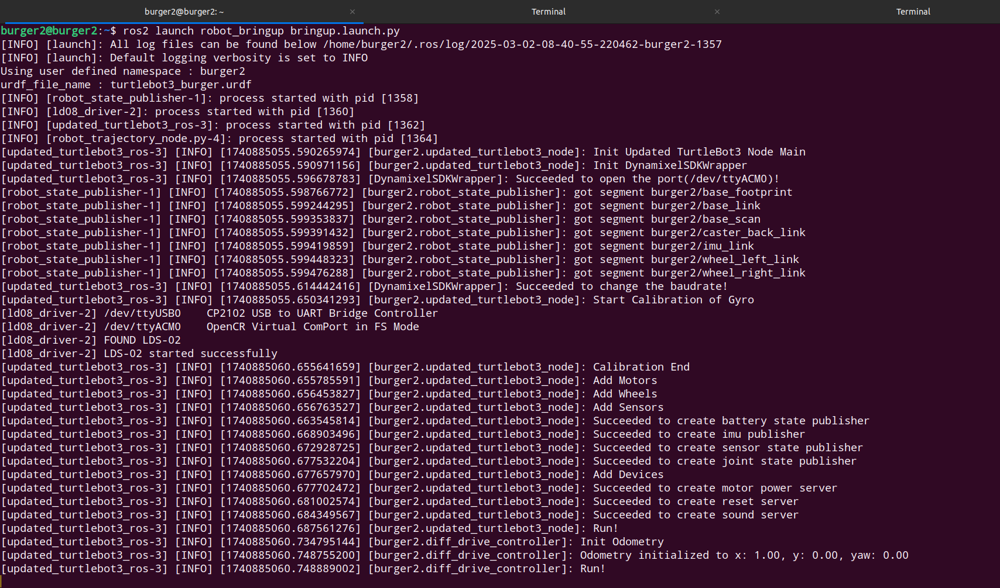
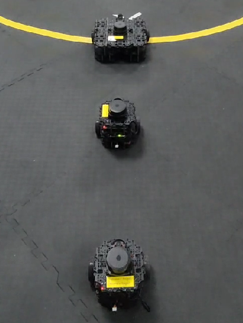
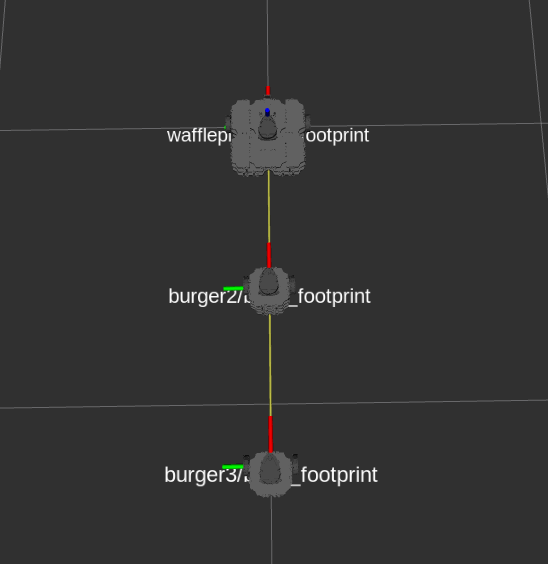

# Introduction
- This ros2 package is the implementation of platoon architecture & control being done as part of my BTP under [Prof. Arnab Dey](https://www.iitr.ac.in/~EE/Arnab_Dey).    

- This doc provides step by step process to setup this package & implement the results on the turtlebot3 hardware (also compatible with simulation).   

- This package implements platoon architecture using namespaced bringup files (to uniquely identify robots in the same ros2 environment).    

- The platoon control is implemented using the leader-follower trajectory control approach.     

- Static and dynamic obstacle avoidance is tested for simple environment by considering it as a lane changing problem for the current vehicle (robot).   

- Following terminology is used in this doc :   

  1. **SBC** --> The raspberrypi board on turtlebot3 hardware with installed ubuntu-22 server OS and ROS2 Humble.    

  2. **Remote PC** --> Your laptop or PC from where you will be running robots (via SSH) and running scripts.


## Repository Structure    

```bash 
    ├── DEBUGGING.md                                # debug instructions
    ├── LICENSE                                     # license information
    ├── PROJECT_GUIDE.md                            # complete project understanding
    ├── README.md                                   # main guide to setup & implement project
    ├── TURTLEBOT3_HARDWARE_SETUP.md                # turtlebot3 hardware setup guide
    ├── media                                       # pictures/plots used as contents
    │   ├── burger_bringup
    │   │   ├── bringup_log.png
    │   │   ├── bringup_topics.png
    │   │   ├── burger_rqt.png
    │   │   └── burger_tf_frames.png
    │   ├── multi_burger_bringup
    │   │   ├── multi_bringup_rqt.png
    │   │   ├── multi_bringup_tf_frames.pdf
    │   │   ├── multi_bringup_tf_frames.png
    │   │   └── multi_bringup_topics.png
    │   ├── ns_burger_bringup
    │   │   ├── ns_bringup_log.png
    │   │   ├── ns_bringup_rqt.png
    │   │   ├── ns_bringup_tf_frames.png
    │   │   └── ns_bringup_topics.png
    │   ├── platoon
    │   │   ├── lane_change.png
    │   │   ├── lane_change_eqn.png
    │   │   ├── lane_change_text.png
    │   │   ├── platoon_hardware.png
    │   │   └── platoon_rviz.png
    │   └── sbc_setup3.png
    ├── platoon                                     # meta package for containing other sub packages
    │   ├── CMakeLists.txt
    │   └── package.xml
    ├── platoon_control                             # package to implement platoon control
    │   ├── CMakeLists.txt
    │   ├── launch
    │   │   └── platoon_control.launch.py           # run platoon control nodes for all the robots
    │   ├── package.xml
    │   ├── params
    │   │   └── platoon_control.yaml                # specify platoon structure
    │   └── src
    │       ├── aruco_pose_node.py                  # detecting multiple ArUco markers with Intel RealSense camera and publishing their poses and IDs.
    │       ├── back_to_lane.py                     # after overtaking the obstacle bot attempts to return back to the previous original lane along with goal navigation.

    │       ├── camera_first.py                     # navigation logic implemented by getting postions of obstacles using ArUco markers instead of scan data.
    │       ├── direct_to_goal.py                   # after overtaking the obstacle the bot does not attempt to return to its original lane. It directly targets goal.
    │       ├── formation_control_node.py  # platoon control node
    │       └── lane_changing.py                    # if any obstacle is detected in the way of bot it will compleetly move to the left or right lane irrespective of the size of the obstacle unlike back_to_lane and direct_to_goal logics which depend on the shape and size of obstacles.

    ├── robot_bringup                               # package to bringup robots with namespaces
    │   ├── CMakeLists.txt
    │   ├── launch
    │   │   ├── bringup.launch.py                   # Main bringup file to run the robot
    │   │   ├── ld08.launch.py
    │   │   └── robot_state_publisher.launch.py
    │   ├── package.xml
    │   ├── param                                   # namespacing nodes and specifying start position 
    │   │   ├── burger.yaml
    │   │   ├── waffle.yaml
    │   │   └── waffle_pi.yaml
    │   └── src
    │       ├── robot_trajectory_node.py
    │       └── update_ns_param.py                  # file to replace dummy namespace in param folder
    ├── robot_teleop                                # package to teleoperate the robot 
    │   ├── CMakeLists.txt
    │   ├── package.xml
    │   └── src
    │       └── teleop_keyboard.py                  # teleoperation node
    └── updated_turtlebot3_node                     # turtlebot3_node package with updates to initialize custom odometry
        ├── CMakeLists.txt
        ├── include
        │   └── updated_turtlebot3_node
        ├── package.xml
        ├── param
        │   ├── burger.yaml
        │   ├── waffle.yaml
        │   └── waffle_pi.yaml
        └── src
            ├── devices
            ├── diff_drive_controller.cpp
            ├── dynamixel_sdk_wrapper.cpp
            ├── node_main.cpp                       # main executable node of updated_turtlebot3_node pkg
            ├── odometry.cpp                        # file to initialize and update odometry
            ├── sensors
            └── turtlebot3.cpp

```

## Requirements

- Working turtlebot3 hardware    
- Ubuntu 22.04 LTS Desktop (in Remote PC)     
- ROS2 Humble (in Remote PC)   

## Turtlebot3 Hardware setup     

- In case you need some guide on setting up turtlebot3 hardware with tricks, i've made one which you can follow:     

    [Turtlebot3 complete setup guide](/TURTLEBOT3_HARDWARE_SETUP.md)

## Install dependencies on Remote PC

- Update your debian packages :

  ```bash
  sudo apt update && sudo apt upgrade -y
  ```

<!-- - Make sure you have already setup the [`Turtlebot3 hardware & software`](/TURTLEBOT3_HARDWARE_SETUP.md) before going further. -->

- Install gazebo11-classic to simulate (in case you want to) your work & other turtlebot3 dependencies (necessary in all cases) :

  ```bash
  sudo apt install gazebo
  sudo apt install ros-humble-gazebo-*
  sudo apt install ros-humble-cartographer
  sudo apt install ros-humble-cartographer-ros
  sudo apt install ros-humble-tf-transformations
  sudo apt install ros-humble-tf2-tools
  sudo apt install ros-humble-navigation2
  sudo apt install ros-humble-nav2-bringup
  sudo apt install ros-humble-dynamixel-sdk
  ```

## Setting up the project  

### 1. Create a ROS2 workspace for this project in your remote PC :

- Open terminal and type these commands :

  ```bash
  cd ~
  mkdir -p ~/btp_ws/src
  cd ~/btp_ws/src
  git clone -b humble-devel https://github.com/ROBOTIS-GIT/turtlebot3_msgs.git
  git clone -b humble-devel https://github.com/ROBOTIS-GIT/turtlebot3.git
  git clone https://github.com/ab31mohit/platoon.git
  cd ~/btp_ws/src/turtlebot3/
  rm -rf turtlebot3_cartographer/ turtlebot3_navigation2/ turtlebot3_example/
  cd ~/btp_ws/
  colcon build --parallel-workers 1
  echo "source ~/btp_ws/install/setup.bash" >> ~/.bashrc
  ```    

    Make sure all the above cloned packages are built without any errors.       
    
    In some cases you might face some warnings after building. Just rebuild the workspace again and they'll be gone.    

    Also try to build the packages always using the command `colcon build --parallel-workers 1` to build them one by one.     


### 2. Configure ROS2 environment in your remote PC :

- Include Cyclone DDS implementation for ROS2 Middleware

  ```bash
  sudo apt install ros-humble-rmw-cyclonedds-cpp
  echo "export RMW_IMPLEMENTATION=rmw_cyclonedds_cpp" >> ~/.bashrc
  ```

- Export custom ROS_DOMAIN_ID for your entire project   

  ```bash
  echo "export ROS_DOMAIN_ID=13"
  ```
  I'm using `13` as my ros domain id. You can use anything between 0 and 232.    
  
  But make sure it is same for the SBC's of all the robots and your remote pc.

- Export the TURTLEBOT3_MODEL environment variable in your remote PC's `.bashrc` file:    

  ```bash
  echo "export TURTLEBOT3_MODEL=burger" >> ~/.bashrc
  ```

  Make sure to change the model according to the hardware you are using. (like burger or waffle_pi)

- Export the TURTLEBOT3_NAMESPACE in your remote pc

  ```bash
  echo "export TURTLEBOT3_NAMESPACE=default_ns" >> ~/.bashrc
  ```     

  ***Note:***     

    - Here i'm using a dummy namespace ***default_ns*** for documentation purpose.    

    - Make sure to change this namespace according to your robot's name.                                                              

    - This namespace is used to connect to a specific robot (within the platooned ros2 environment) to access its topics/data.                         

    - For my work, i've used a specific pattern for these namespaces which is ***TURTLEBOT3MODELInstance***.                        

    - For instance, the first burger will have namespace as *burger1* & third waffle_pi will have *wafflepi3* as its namespace to identify them easily in the platoon environment.  


### 3. Configure ROS2 environment in SBC (for each of the robots) :     

  Considering you have already configured your Hardware setup as mentioned [here](/TURTLEBOT3_HARDWARE_SETUP.md), follow the below steps to setup this project.    

- SSH into the Robot's RPI from your Ubuntu-22 terminal by connecting both to the same local network :

  ```bash
  ssh user_name@ip_address_rpi
  ```    
  Change *user_name* and *ip_address_rpi* to the username & ip_address of your SBC's RPI.

  ***Note:***     

    - I would suggest you to use some tools such as termux or other to determine ip address of the SBC of your robot
      so that you don't need to connect your SBC to some monitor for its IP Address.

- Export the  ROS_DOMAIN_ID in SBC : (should be same for both, remote pc and SBC)

  ```bash
  echo "export ROS_DOMAIN_ID=13" >> ~/.bashrc
  ```
- Export namespace for your robot in SBC :    

  ```bash
  echo "export TURTLEBOT3_NAMESPACE=burger1" >> ~/.bashrc
  ```    
  
  Make sure to change this namespace according to your Robot's namespace.    
  
  Pattern for writing namespaces have been specified above in this doc.

- Clone this github package inside turtlebot3_ws in the SBC of your robot :    

  ```bash    
  cd ~/turtlebot3_ws/src
  git clone https://github.com/ab31mohit/platoon.git
  ```

- Update the params in this package according to your robot namespace : 

  ```bash
  cd ~/turtlebot3_ws/src/platoon/robot_bringup/src/
  python3 update_ns_param.py
  ```    

  This file will replace the dummy namspace in [*burger.yaml*](/robot_bringup/param/burger.yaml) to the above specified one.      

  Obvioulsy it will change this file only if your robot model is burger as it also takes the robot model environment variable as input and changes that corresponding param file accordingly.
  
  This will ensure all the important topics of this robot are initialized with a certain namespace (that you've set before).
  
  Do note that, running this file is a one time process for setting up SBC of your robot.    
  
  Also you don't need to run this on your remote pc, as the bringup file will be running from SBC and it will automatically set the namespaces according to the data of [*param*](robot_bringup/param/) folder.   


- Set initial pose of the robot :    

  You can initialize the odometry/pose of the robot by changing [*burger.yaml*](/robot_bringup/param/burger.yaml) file (considering your robot model is *burger*).      
    
  By default the initial transform between *world* and *default_ns/base_footprint* frame is [0, 0, 0] which is the starting value of odometry. 

  For platoon initialization, you will need to initialize all the robots at different positions in the same ros2 environment, so you can do that through this file.    


- Build the `turtlebot3_ws` in RPI : 
  
  ```bash
  cd ~/turtlebot3_ws/
  colcon build --parallel-workers 1
  ``` 
 
## Running the package 

  In this step you will bringup all the robots by connecting all of them along with your remote pc to same network.  

  You will need to know the ip addresses of all those robots so that you can SSH into them (for running their bringup files) from your Remote PC.     

### 1. Run bringup launch file for all the robots from your remote PC :    

- SSH into your robot's SBC from remote PC : 

  ```
  ssh rpi_username@rpi_ipaddr
  ```   
  Replace *rpi_username* & *rpi_ipaddr* to the username & ip address of your specific robot's SBC.    

- Run bringup file for the robot via above SSH connection :  

  ```
  ros2 launch robot_bringup bringup.launch.py
  ```   

  The log of this file should look like something like this  

    <div align="center">
      
    </div>   

  Here, I'm running ***burger*** (TURTLEBOT3_MODEL) with the namespace ***burger2*** (TURTLEBOT3_NAMESPACE).   

- Open a new tab in the remote PC & run : 
 
  ```
  ros2 topic list
  ```   
  If you're following everything correctly, it will show the topics started by bringup launch file of this robot in your remote PC.    
  
  The reason for this is because of the same network and ROS_DOMAIN_ID between your remote PC and Robot's RPI.   
  
  It will show the topics something like this :    

    <div align="left">
    
    </div>   

  Here all the topics of this robot are namespaced with ***burger2*** as i used that as the namespace for this robot except ***/tf*** and ***/tf_static***.       

  The transformation data on ***/tf*** & ***/tf_static*** topics is not namespaced for each robot, instead it contains the complete frame transformation data between all the robots (when run together).

  Now do the same bringup operation for all the robots.    

  After running all the robots together, the environment should look like this :     

  <!-- Testing platoon bringup -->
  <!-- |                          Hardware                            |                         Rviz                          |
  |--------------------------------------------------------------|-------------------------------------------------------|
  |    | | -->

    <table>
        <thead>
            <tr>
            <th style="text-align:center;">   Hardware bringup  </th>
            <th style="text-align:center;">Rviz data</th>
            </tr>
        </thead>
        <tbody>
            <tr>
            <td style="text-align:center;">
                
            </td>
            <td style="text-align:center;">
                
            </td>
            </tr>
        </tbody>
    </table>

### 2. Run the platoon control module :    

  - Platoon control part is implemented in the [platoon_control](/platoon_control/) package.    

  - This package contains a launch file named [platoon_control.launch.py](/platoon_control/launch/platoon_control.launch.py) file which runs the trajectory follower nodes for each pair of leader-follower robots within the platoon.     

  - The information of these pairs of leader-follower robots is specified within the [platoon_control.yaml](/platoon_control/params/platoon_control.yaml) file.   

  - Depending on the position of robots in your linear platoon, change the robot names accordingly in the [platoon_control.yaml](/platoon_control/params/platoon_control.yaml) file.    

  - Run the launch file for platoon control    

    ```bash  
    ros2 launch platoon_control platoon_control.launch.py
    ```       

  - This will initialize the relative distance between robots by using the current position of robots in the platoon and will try to maintain that when one of them moves forward.       

### 3. Run the goal node :   

  - Run the goal navigation node to move the first robot in the platoon (leader) to the goal while avoiding obstacles    

    ```bash   
    cd ~/btp_ws/src/platoon/platoon_control/src/   
    python3 lane_changing.py
    ```    
    
    - Make sure you have changed variables such as goal (x, y) and lane_width in the *lane_changing.py* node.

## Results    

  The video/picture results for different scenarios are as follows :      


  1. [Platoon control for a single set of leader follower](https://drive.google.com/file/d/17kOYZ_MorR6m7O9nQKXy5yPtRre6W99N/view?usp=sharing) :     

      - in this case, the leader was teleoperated from the keyboard using [teleop_keyboard.py](robot_teleop/src/teleop_keyboard.py) node.  
      - the follower was running the [platoon_control.launch.py](platoon_control/launch/platoon_control.launch.py) file.     

  2. [Platoon control with three robots and a static obstacle](https://drive.google.com/file/d/1sQWRfjM5dRVhDmP_qC5Lvjde848lwWqA/view?usp=sharing) :    

      - in this case, the leader was given some goal and it was running the [lane_changing.py](platoon_control/src/lane_changing.py) node.    
      - the other 2 robots were running the [platoon_control.launch.py](platoon_control/launch/platoon_control.launch.py) file and the [platoon_control.yaml](platoon_control/params/platoon_control.yaml) file specified the leader-follower sets.     

  3. [Platoon control with 2 robots and a dynamic obstacle](https://drive.google.com/file/d/1nnj8WbNjm0aAW5XdpUUlXpR5N-95k62B/view?usp=sharing) :    

      - in this case, leader was given some goal and it was running the [lane_changing.py](platoon_control/src/lane_changing.py) node.
      - the follower robot was running the [platoon_control.launch.py](platoon_control/launch/platoon_control.launch.py) file which was triggering the [lane_changing.py](platoon_control/src/lane_changing.py) node upon dynamic obstacle detection. 
  
  4. [Obstacle avoidance of one robot using ArUco marker and Intel RealSense Camera](https://drive.google.com/file/d/1dlP7sj0PyF6Sr1llmrMypnQDodX6jMBD/view?usp=sharing)

      - The environment setup consists of an Intel RealSense camera mounted on the ceiling at the center of the room, providing a top-down view. Two robots are placed within the camera’s field of view. The obstacle avoidance algorithm is executed by running the [aruco_pose_node.py](platoon_control/src/aruco_pose_node.py) and [camera_first.py](platoon_control/src/camera_first.py) scripts, which processes the camera feed for real-time navigation and obstacle detection.

  5. [Single robot avoiding multiple obstacles in its path](https://drive.google.com/file/d/1fbesjFEPDyxVDBl8HGnJY1702PFZdQKJ/view?usp=sharing)

      - The obstacle avoidance behavior in this setup is implemented by running the [lane_changing.py](platoon_control/src/lane_changing.py) file, which has core logic that manages lane change maneuvers and obstacle avoidance.

  6. [Obstacle avoidance using direct_to_goal logic](https://drive.google.com/file/d/11IKp8m76IymTMJbJOfiRmIsZZsAaL20j/view?usp=sharing)

      - Here, the obstacle avoidance logic from [direct_to_goal.py](platoon_control/src/direct_to_goal.py) is utilized. As observed in the RViz path visualization, once the robot passes the obstacle, it proceeds directly toward the goal without attempting to return to its initial lane.

  7. [Obstacle avoidance using back_to_lane logic](https://drive.google.com/file/d/11suMc-pnLZQfknodl26EQ0NcGngPLmh2/view?usp=sharing)

      - The obstacle avoidance logic utilized here is from the [back_to_lane.py](platoon_control/src/back_to_lane.py) file, which guides the robot to return to its initial lane after overtaking an obstacle.
